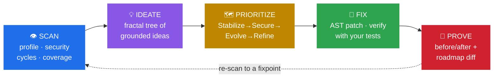
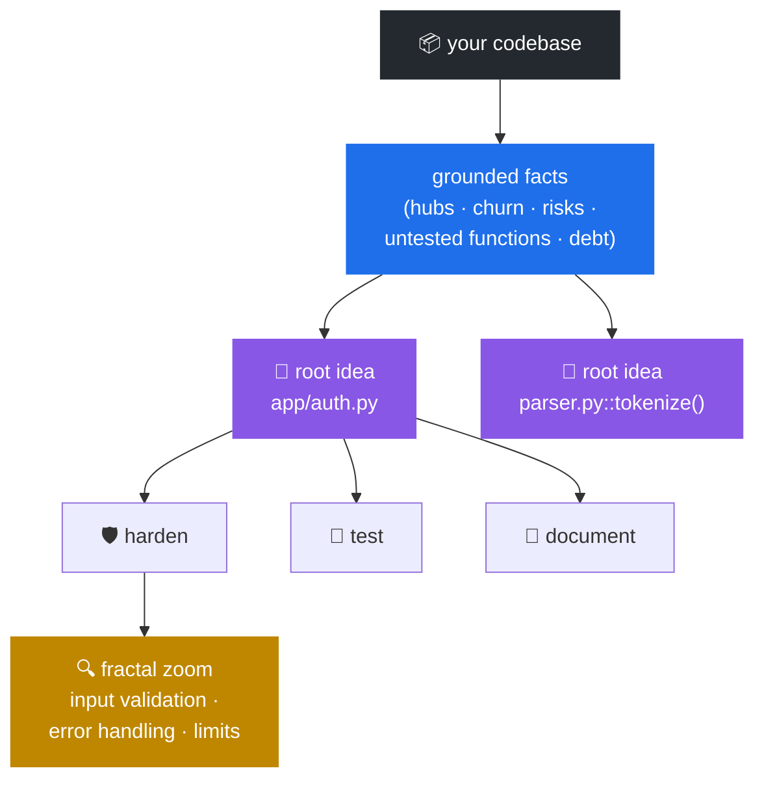
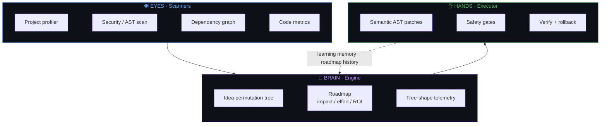

<div align="center">

# 🧠 Apex Orchestrator

### A deterministic engineering agent that *reasons* about your codebase — and helps you act on it.

[](https://www.python.org/)
[]()
[-2ea44f)]()
[]()
[](LICENSE)

<br/>

**Scan → Ideate → Prioritize → Fix → Prove.**
Apex profiles your project, proposes a grounded engineering roadmap, and applies **real, test‑verified fixes** under strict safety gates — its core runs **deterministically, offline, with no LLM**, so it's cheap, reproducible, and safe to drop into CI.

<br/>

[**🌐 Website**](https://mert544.github.io/Apex-orchestrator/) · [**📊 Live demo**](https://mert544.github.io/Apex-orchestrator/demo.html) · [**🚀 Quick Start**](#-quick-start) · [**💡 Idea Engine**](#-the-idea-engine) · [**🗺️ Roadmap**](#️-roadmap-grounded-prioritization) · [**🤖 Maintenance**](#-guarded-autonomous-maintenance) · [**🛡️ Safety**](#️-safety-model)

</div>

---

## ⚡ In 30 seconds

```bash
pip install apex-orchestrator   # from a clone: pip install -e .[dev]
apex                            # assess, prioritize, apply safe fixes when it's safe to
```

> One command. No API keys, no network, no config. On a clean git tree it applies safe, test‑verified
> fixes (and leaves them *uncommitted* so you review with `git diff`); on a dirty tree it just recommends.

---

## 🎯 What it does

Most code tools stop at a flat list of issues. Apex is a small engineering brain — **eyes** that see your code, a **brain** that reasons about how to develop it, and **hands** that change it safely.



| Stage | What Apex does | Command |
|---|---|---|
| 👁️ **Scan** | Profiles structure; finds security risks, import cycles, fragile/untested modules | every run |
| 💡 **Ideate** | Generates a **fractal tree of grounded development ideas** from real code facts | `apex ideate` |
| 🗺️ **Prioritize** | Sequences ideas into a phased roadmap with **impact / effort / ROI** from measured structure | `apex ideate --roadmap` |
| 🔎 **Review** | Reviews a PR diff like a human — issues on the *changed* lines, with a **suggested‑fix diff** for clean one‑liners, CI‑ready | `apex review` |
| 🤖 **Fix** | Applies real, **test‑verified** fixes with automatic rollback + safety gates | `apex maintain` |
| ♻️ **Refactor** | **Cross‑file rename & module move**: definitions, imports and call sites rewritten across the whole project, comment‑preserving, blocked on any ambiguity, test‑verified | `apex rename old new` · `apex move a/old.py b/new.py` |
| 🔁 **Evolve** | Improves cycle by cycle **to a fixpoint**, then proves the gain | `apex evolve` |
| 🧪 **Simulate** | Previews autonomous improvement — on a throwaway copy, changing nothing | `apex simulate` |
| 🎓 **Grade** | One memorable health grade (A–F), with the cheapest ways to climb | `apex grade` |
| 📊 **Report** | One self‑contained HTML dashboard of everything above | `apex dashboard` |

Everything is **deterministic** (same input → same output) and **traceable** (every idea cites the concrete code fact that produced it). An optional LLM layer exists but is **off by default**.

<details>
<summary><b>🔬 What Apex detects &amp; fixes</b> — one canonical AST detector powers both <code>review</code> and the grade (and honours inline <code>#&nbsp;noqa</code> / <code>#&nbsp;nosec</code>)</summary>

<br/>

| Category | Detected | Auto‑fixed? |
|---|---|---|
| **🔒 Security** | `eval`/`exec`, `os.system`, `subprocess(shell=True)`, `pickle.loads`, `yaml.load`, f‑string SQL, `tempfile.mktemp` (B306), weak `hashlib.md5/sha1` (B324), hardcoded secrets, bare `except`, `except BaseException` (B036) | eval→`literal_eval`, `os.system`→`subprocess.run(shlex.split(...))`, bare‑except→`except Exception`, `except BaseException`→`except Exception`; pickle/sql/tempfile/weak‑hash **flagged** |
| **🐛 Correctness** | frozen‑dataclass mutation, `return`/`break`/`continue` in `finally`, unreachable `except`, identity‑vs‑literal (`x is 5`, F632), comparison‑with‑itself, raise‑without‑`from` (B904), `assert` on a tuple | `x is 5`→`x == 5`, negated membership/identity (E713/E714) |
| **🧱 Reliability** | `open()` without `encoding=`, network call without `timeout=` | `open(...)`→`encoding="utf-8"`; timeout flagged |
| **🧹 Code debt** | `== None`→`is None`, mutable default args (value‑preserving, `T \| None` when safe) | yes |
| **🧪 Coverage** | untested modules, **shallow‑only tests** (smoke/type stubs), complexity **hotspots down to the function**, TODO/FIXME clusters, dead code (confidence‑ranked) | generates real characterization tests |

The grade rolls these into five components — **Security · Architecture · Testing · Code debt · Correctness** — each severity‑weighted, with test/fixture code excluded and shallow tests given only **half credit** (so a clean A+ can't be faked with stub tests).

</details>

---

## 🚀 Quick Start

```bash
# Install
python -m venv .venv && source .venv/bin/activate     # Windows: .venv\Scripts\activate
pip install -e .[dev]

# Verify (1880+ tests, fully offline)
pytest -q
```

**One command to remember — `apex`:**

```bash
apex                        # autonomous review — applies safe fixes when it's safe to
apex "harden security"      # focus the review with a plain-English goal
apex auto --recommend       # read-only: review and recommend, never touch the tree
apex auto --apply --commit  # full autonomy: apply verified fixes and commit each one
```

`apex` assesses the project, prioritizes the highest‑ROI work, and **decides for itself whether to act**: on a clean git tree with safe, verified fixes available it applies them (in roadmap order, capped, auto‑rolled‑back, *not committed*); on a dirty tree — or when nothing is safely auto‑applicable — it recommends and tells you the one command to proceed. The specialized commands below are there when you want them; you never *have* to memorize them.

---

## 🛡️ Use Apex in CI (drop‑in GitHub Action)

Gate any repo on a deterministic, test‑verified health grade — no API keys, no cost:

```yaml
# .github/workflows/apex.yml
name: Apex health gate
on: [pull_request]
jobs:
  apex:
    runs-on: ubuntu-latest
    steps:
      - uses: actions/checkout@v4
        with: { fetch-depth: 0 }            # full history for the diff review
      - uses: Mert544/Apex-orchestrator@v1
        with:
          min-score: "80"                   # fail the PR if the grade drops below 80
          base: origin/${{ github.base_ref }}
          fail-on-high: "true"              # fail if a high-severity issue is in the diff
```

The action grades the project (`apex grade --min-score`) and runs a diff‑scoped review (`apex review --fail-on-high`). Both are offline and deterministic, so the gate is fast and reproducible. Add `apex review --sarif apex.sarif` to upload findings to **GitHub code scanning** (SARIF 2.1.0), so they appear inline on the PR instead of in a build log.

---

## 💡 The Idea Engine

Apex doesn't only *analyze* code — it proposes **how to develop it**. The **Idea Permutation Engine** splits a project into development branches derived from its real structure, then permutes each through development "lenses" — the *"abc"* applied to every *"a"*:



```bash
apex ideate --target=. --depth=2 --breadth=4      # the idea tree
apex ideate --target=. --facets --facet-depth=2   # fractal zoom into specifics
apex ideate --target=. --actions --top=10         # map ideas → a supervised plan
apex explain x.a.c --target=.                      # why does this idea score what it does?
apex ideate --target=. --pareto                   # the efficient frontier (non-dominated only)
```

Every idea is **traceable to a concrete project fact**, scored by relevance × novelty × feasibility, and stress‑tested with **caveats that name the actual code** — including down to the *function*: Apex finds the heaviest‑branching functions no test ever names and asks for behavioral tests on *them*, not just the file. The fact base goes beyond static structure: a **git‑churn signal** ranks the modules recent commits touch most, so the engine reasons about where the project is *alive*, not only where it is risky. And the **fractal zoom** stays content‑aware for three levels — `harden → resource limits → time and timeout bounds → deadline propagation` — with each facet either citing line‑level evidence (a 📌 *verified observation*) or honestly labeled a hypothesis.

> **It reasons about where problems converge.** When several independent analyses flag the *same* module — `app/auth.py` is security‑sensitive **and** a complexity hotspot **and** untested — Apex doesn't list three separate items. It emits one **convergence** idea that names the agreement, ranks it the highest‑leverage target, and **auto‑expands it into a phased mini‑roadmap** — *Stabilize* (add the safety‑net tests) **before** *Secure* (harden the risky code), because you don't change what you can't re‑verify. The dimensions include **high‑churn**, so the classic *change × complexity* hotspot — complex code that recent commits touch most — surfaces as the strongest refactoring mandate. Each step is executable where a deterministic fix exists. That's the difference between a linter and a brain.

<details>
<summary><b>🧠 It gets wiser over time</b></summary>

<br/>

Apex is deterministic but not amnesiac. Each time it applies fixes (`auto`, `maintain`, `evolve`), it records which kinds of ideas landed cleanly vs. rolled back to `.apex/idea-memory.json`, and on later runs gives a **bounded feasibility nudge** toward the lenses with a strong track record **on your codebase**. With `--adaptive` depth, the branches it has learned to trust grow deeper — a fractal that sharpens where it pays off. With no memory file, scoring is identical to a fresh engine, so determinism is never compromised. The engine also **synthesizes** ideas no single lens yields — e.g. a *security‑focused test suite* for a module needing both hardening and tests, or *break this import cycle* from the dependency graph.

</details>

---

## 🗺️ Roadmap: grounded prioritization

A list of ideas is noise without an order. `--roadmap` sequences the whole tree into the phases an experienced engineer follows — **build a safety net before changing risky code, secure what's exposed, then evolve, then polish** — scoring each idea with **impact, effort, and ROI grounded in measured structure**:


- **Impact** = real *blast radius* (how many modules import the subject) + structural risk.
- **Effort** = real *size* (measured LOC + branch complexity) + how deep the idea is.
- **Quick wins** = high impact, low effort — surfaced across all phases.

```bash
apex ideate --target=. --roadmap                                  # the phased plan
apex ideate --target=. --roadmap --save                          # snapshot today's roadmap
apex ideate --target=. --roadmap --diff   # what's new / resolved / shifted — and WHICH SIGNAL caused it
apex ideate --target=. --roadmap --actions --phase=Secure --apply --verify
```

```text
# Engineering Roadmap for `.`
30 ideas sequenced · mean ROI 1.44

## ⚡ Quick wins (high impact, low effort)
- x.a.c  Test: app/engine/debug_engine.py        (ROI 2.41 · impact 1.0 · effort 0.42)

## Phase 1: Stabilize — Build a safety net before changing risky code
- x.a.c  Test: app/engine/debug_engine.py    (ROI 2.41 · imported by 6 · 330 LOC)
- x.c    Reduce fragility of claim_analyzer.py (ROI 1.86 · imported by 4 · 50 LOC)
```

The cross‑run diff doesn't just count the delta — it **narrates why the roadmap changed**: which signal produced each new idea, and which signal stopped firing for the resolved ones.

```text
# Roadmap Changes Since Last Run
4 new · 2 no longer surfaced · 36 stable

**Where the new work comes from:** `convergence` ×3, `churn-hotspot`
**Signals that stopped firing:** `security-finding`

## 🆕 New ideas
- [Stabilize] Prioritize app/engine/detectors.py — 2 independent analyses converge
  (a complexity hotspot and high-churn)  (ROI 1.69) — grounded in `convergence: a complexity hotspot+high-churn`
```

---

## 🤖 Guarded autonomous maintenance

One command runs the whole guarded loop: **scan → generate fixes → apply → verify with your tests → roll back failures → commit → report.** Every change is gated by `ModePolicy` + `SafetyGates`, individually verified, and **automatically rolled back if it breaks anything** — a maintenance run can never leave your project broken.

```bash
apex maintain --target=. --mode=report                  # plan only, no changes
apex maintain --target=. --mode=supervised              # apply verified fixes, no commit
apex maintain --target=. --mode=autonomous --commit --out=MAINT.md
```

| Risk | Fix |
|---|---|
| `eval(s)` | → `ast.literal_eval(s)` |
| `os.system(cmd)` | → `subprocess.run(shlex.split(cmd))` |
| bare `except:` / `except BaseException:` | → `except Exception:` |
| `yaml.load(s)` | → `yaml.safe_load(s)` |
| `x == None` | → `x is None` (behavior‑preserving) |
| `x is 5` | → `x == 5` |
| missing docstrings | → generated docstrings |
| `pickle.loads` / SQL f‑strings | flagged (no unsafe auto‑rewrite) |

The run ends with a Markdown report of what was applied, rolled back, or blocked — with per‑step commit hashes in autonomous mode.

**Proof‑of‑Fix:** every apply run also writes a machine‑readable evidence record to `.apex/proof-of-fix.json` (`--proof PATH` to relocate): for each fix, the finding it cites, the exact unified diff, the verifying test run (commands, pass/fail counts, duration), and any rollback. Verification is **coverage‑aware and honest about its own strength**: each fix is graded by whether the green suite actually *names the changed function*, merely *references the module*, or never looks at it at all (“applied blind” — flagged with ⚠️). You don't have to trust the report — you can audit it.

**Risk‑tiered autonomy:** every fix carries an explicit risk tier. **Tier 0** (semantics‑preserving: docstrings, import tidying, `== None` → `is None`) auto‑applies under the normal verify/rollback loop. **Tier 1** (behavior‑adjacent: `eval` rewrites, mutable defaults) applies **only when the suite actually covers the target** — if nothing references the module, Apex first generates a 🛡️ characterization test (the *test‑first shield*) and fixes under its protection; if no shield can be built, the fix is **blocked, not gambled**. **Tier 2** (design‑level) is never auto‑applied. The tier is recorded in the proof artifact.

<details>
<summary><b>🔁 Self‑improvement loop (<code>apex evolve</code>)</b> — converge to a fixpoint, then prove the gain</summary>

<br/>

`apex evolve` applies guarded fixes **cycle after cycle until a fixpoint** (no further fix can be safely applied and verified), then **proves the project got healthier** — a before/after of security findings, open safe fixes, and mean ROI, plus a roadmap **diff** of exactly which ideas it resolved.

```bash
apex evolve --target=. --max-cycles=3      # apply to a fixpoint, prove the gain
apex evolve --target=. --dry-run           # preview the first cycle, change nothing
apex evolve --target=. --commit            # commit each verified fix as it lands
```

```text
Ran 3 cycle(s) · applied 9 fix(es) · rolled back 0 · mode supervised

## Before → After
- Security findings: 2 → 0  ✅
- Open safe fixes:   26 → 24 ✅

## ✅ Ideas resolved (no longer surface)
- Add a first test layer for app/cfg.py
- Harden: app/parse.py
```

</details>

---

## 🛡️ Safety model

Apex operates in three explicit modes, enforced by `ModePolicy`:

| Mode | What it does | Best for |
|---|---|---|
| 📋 **Report** | Scans and reports only. Zero file changes. | Audits, CI |
| 👁️ **Supervised** | Applies test‑verified patches, **never commits**. | Daily development |
| 🤖 **Autonomous** | Applies, verifies, and commits each fix individually. | Trusted environments |

**SafetyGates** additionally enforce: a max‑changed‑files scope limit, blocked sensitive paths (`.env`, `secrets/**`, `*.pem`), secret detection, mandatory test verification after every patch, and a rollback‑ready journal for every change. Patches are always staged in a sandbox first.

---

## 📊 Dashboard

```bash
apex dashboard --target=. --out=report.html
```

A single self‑contained HTML file (no external assets): project overview, scan findings, **architecture health** (import cycles, fragile modules), the **idea tree**, **tree‑shape telemetry**, the **engineering roadmap** with ROI bars, the action plan, and reasoning telemetry.

---

## 🧩 Claude Code integration

This repo ships first‑class [Claude Code](https://code.claude.com) customizations in `.claude/`, so you (and Claude) can drive *and extend* Apex from your editor:

- **Slash commands** — `/apex-ideate`, `/apex-roadmap`, `/apex-maintain` (safe dry‑run default), `/apex-dashboard`
- **Subagents** — `apex-auditor` (read‑only health report), `apex-test-writer` (parallel coverage specialist), `apex-engineer` (builds a deterministic engine feature end‑to‑end)
- **Skills** — `apex` (run & extend), `apex-cover` (coverage recipe), `apex-ship` (commit/verify discipline)

---

## 🏗️ Architecture



Optional surfaces: an **MCP server** (stdio + HTTP/SSE) for IDE integration, a **Prometheus** metrics endpoint, an **LSP** server, and a plugin system with hook points and runtime‑contributed idea operators.

---

## 📈 Project status

- ✅ **Idea Permutation Engine** — fractal idea tree, recursive facet zoom, adaptive value‑guided depth, **function‑level** targets, synthesis & module‑pair ideas
- ✅ **Roadmap mode** — phase sequencing + impact/effort/ROI grounded in fan‑in and measured LOC/complexity, the Pareto frontier, cross‑run diffing
- ✅ **Learning memory** — per‑lens apply outcomes bias future scoring (bounded, opt‑in, deterministic)
- ✅ **Self‑improvement loop** (`apex evolve`) — converge to a fixpoint, prove the gain, track the trajectory
- ✅ **Guarded maintenance** — real AST fixes, test‑verified, auto‑rollback, optional per‑fix commits
- ✅ **Dashboard, debug, deadcode, hotspots, self‑audit, MCP, metrics, LSP**
- ✅ **Deterministic, offline core** — LLM is strictly opt‑in
- ✅ **1850+ tests**, ruff‑linted, CI‑gated, self‑graded **A+**

**Experimental (not production‑ready):** the Kubernetes operator, Helm chart, and VS Code extension are skeletal.

---

## 🤝 Contributing

Contributions welcome — see [CONTRIBUTING.md](CONTRIBUTING.md) for setup and conventions.

```bash
pip install -e .[dev]
pytest -q          # run the suite
ruff check app/    # lint
```

---

## 📄 License

Licensed under **Apache‑2.0**. See [LICENSE](LICENSE).

<div align="center">
<br/>

**Built for engineers who believe a codebase deserves real reasoning — not just a linter.**

</div>
